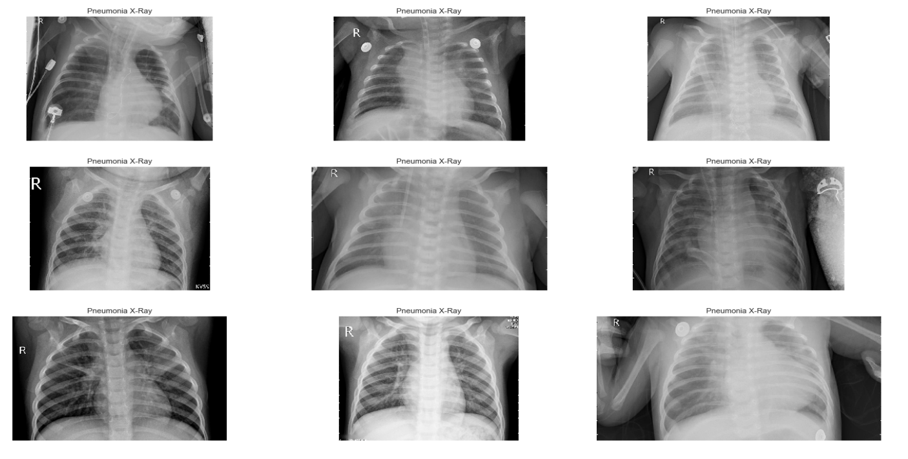
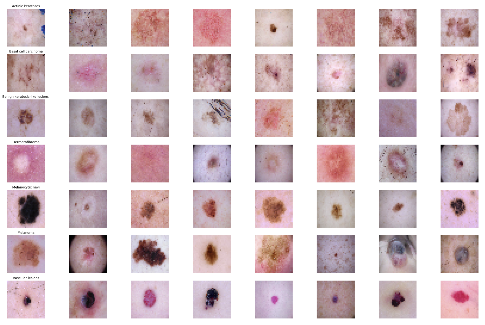
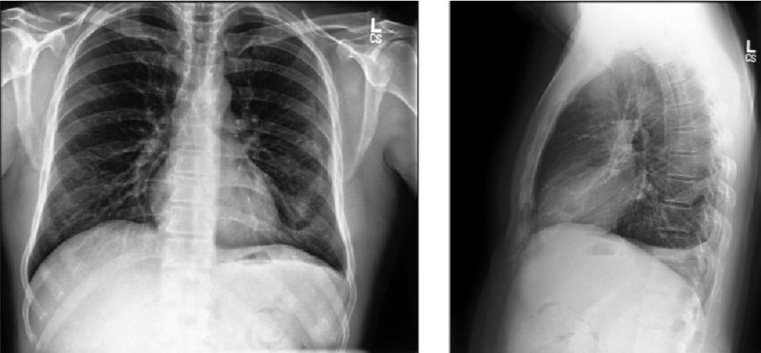
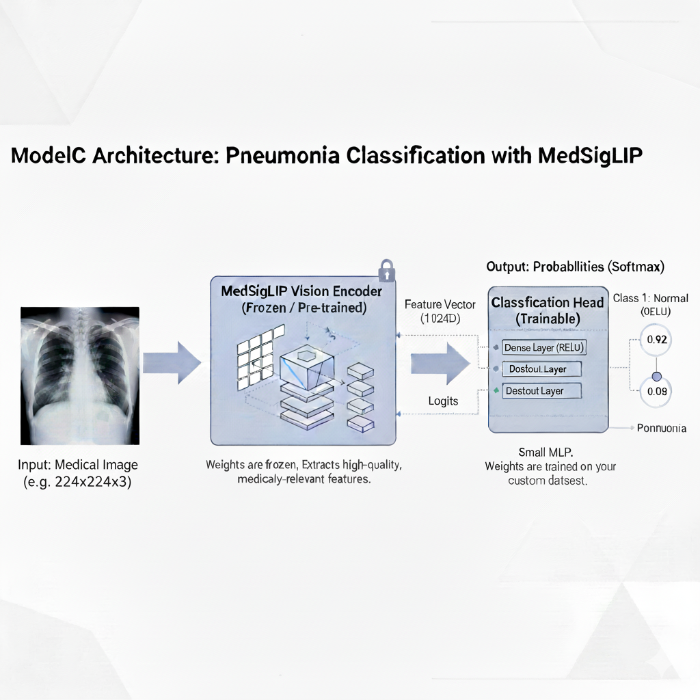

# Low-Medical-Imaging

This project tackles one of medical AI challenges: developing reliable diagnostic models when data is scarce. Through rigorous experimentation, we empirically validate whether transfer learning can overcome the "small data problem" that plagues specialized medical imaging applications. By comparing models trained from scratch against those leveraging pre-trained knowledge, we provide concrete evidence for best practices in low-resource clinical AI deployment.

# 🎯 Problem Statement

Medical AI development faces a critical data scarcity crisis. Creating effective diagnostic tools requires large, expertly annotated datasets, which are often impossible to obtain due to:

🔒 HIPAA privacy regulations limiting data sharing
💰 High annotation costs requiring medical expert time
🏥 Data rarity for specialized conditions and rare diseases

Training complex CNNs from scratch on small datasets leads to severe overfitting and unreliable performance on new patients. Transfer learning offers a promising solution, but requires rigorous empirical validation.

# 🔬 Project Overview

This project provides empirical validation of transfer learning efficacy in low-resource medical imaging scenarios through a controlled three-way comparison:
Three Model Architecture Comparison
ModelDescriptionPurposeModel A (Scratch)Simple CNN trained only on small datasetBaseline performanceModel B (ImageNet Transfer)ResNet-50 pre-trained on ImageNet, fine-tuned on medical dataGeneral feature transferModel C (Medical Transfer)Model pre-trained on broader medical corpusDomain-specific transfer
All models are evaluated under identical conditions to ensure fair comparison.

We utilize three distinct medical imaging datasets to simulate real-world transfer scenarios:  
**1. Chest X-ray Images (Pneumonia)**
Source: Guangzhou Women and Children's Medical Center  
Task: Pneumonia detection from chest radiographs  
Link: [Kaggle Dataset](https://www.kaggle.com/datasets/paultimothymooney/chest-xray-pneumonia)

**2. HAM10000 Dermatoscopic Images**
Source: Harvard Dataverse  
Task: Classification of common pigmented skin lesions  
Link: [Harvard Dataverse](https://doi.org/10.7910/DVN/DBW86T)

**3. CheXpert Dataset**
Source: Stanford ML Group  
Task: Multi-label chest radiograph classification  
Link: [Stanford ML Group](https://arxiv.org/abs/1901.07031)

**Data Strategy**

Training Set: Deliberately constrained to 100-200 labeled images per condition  
Test Set: Large, unbiased holdout for reliable evaluation  
Augmentation: Aggressive augmentation

# Dataset Description

**1.Chest X-Ray Images (Pneumonia)**  
The dataset is organized into 3 folders (train, test, val) and contains subfolders for each image category (Pneumonia/Normal). There are 5,863 X-Ray images (JPEG) and 2 categories (Pneumonia/Normal).


**2.HAM10000 Dermatoscopic**
The HAM10000 dataset, a large collection of multi-source dermatoscopic images of common pigmented skin lesions.


**2.CheXpert**
The dataset includes labels for 14 thoracic pathologies (including Pneumonia, Edema, Atelectasis, Pleural Effusion, etc.) with four label types: positive, negative, uncertain, and unmentioned.


## 🛠️ PyTorch Pipeline: Training & Evaluation

This project uses **PyTorch** for building and training transfer learning models. The pipeline consists of:

1. **Data Preprocessing** (`image_preprocessing.py`) — Custom PyTorch Dataset class with built-in augmentation
2. **Model Architecture** (`models.py`) — Transfer learning models (VGG19, ResNet50, InceptionV3, DenseNet121)
3. **Training** (`train.py`) — Training loop with early stopping, checkpoint saving, and fine-tuning
4. **Evaluation** (`evaluate.py`) — Model evaluation with comprehensive metrics

### Quick Start

#### 1. Install Dependencies

```bash
pip install -r requirements.txt
```

#### 2. Dataset Structure

For ChestXray Pheumonia Dataset:

```
dataset/
├── train/
│   ├── Normal/
│   │   ├── image1.jpeg
│   │   └── image2.jpeg
│   └── Pneumonia/
│       ├── image1.jpeg
│       └── image2.jpeg
├── val/
│   ├── Normal/
│   └── Pneumonia/
└── test/
    ├── Normal/
    └── Pneumonia/
```

For HAM10000 Dataset:

```
HAM10000/
├── train/
│   ├── akiec/
│   │   ├── image1.jpg
│   ├── bcc/
│   │   ├── image1.jpg
│   ├── bkl/
│   │   ├── image1.jpg
│   ├── df/
│   │   ├── image1.jpg
│   ├── mel/
│   │   ├── image1.jpg
│   ├── nv/
│   │   ├── image1.jpg
│   └── vasc/
│       ├── image1.jpg
├── val/
│   ├── akiec/
│   ├── bcc/
│   ├── bkl/
│   ├── df/
│   ├── mel/
│   ├── nv/
│   └── vasc/
```

For CheXpert Dataset:

```
CheXpert_Dataset/
├── train/
│   ├── Atelectasis/
│   │   ├── image1.jpg
│   ├── Cardiomegaly/
│   │   ├── image1.jpg
│   ├── Consolidation/
│   │   ├── image1.jpg
│   ├── Edema/
│   │   ├── image1.jpg
│   ├── Effusion/
│   │   ├── image1.jpg
│   ├── Enlarged_Cardiomediastinum/
│   │   ├── image1.jpg
│   ├── Fracture/
│   │   ├── image1.jpg
│   ├── Lung_Lesion/
│   │   ├── image1.jpg
│   ├── Lung_Opacity/
│   │   ├── image1.jpg
│   ├── No_Finding/
│   │   ├── image1.jpg
│   ├── Pleural_Other/
│   │   ├── image1.jpg
│   ├── Pneumonia/
│   │   ├── image1.jpg
│   ├── Pneumothorax/
│   │   ├── image1.jpg
│   └── Support_Devices/
│       ├── image1.jpg
├── valid/
│   ├── Atelectasis/
│   ├── Cardiomegaly/
│   ├── Consolidation/
│   ├── Edema/
│   ├── Effusion/
│   ├── Enlarged_Cardiomediastinum/
│   ├── Fracture/
│   ├── Lung_Lesion/
│   ├── Lung_Opacity/
│   ├── No_Finding/
│   ├── Pleural_Other/
│   ├── Pneumonia/
│   ├── Pneumothorax/
│   └── Support_Devices/
├── train.csv
└── valid.csv
```

## Model Architecture.

**ModelA : DenseNet from Scratch**.
**Architecture Details:**.

Input Layer: [Description of input dimensions and preprocessing]
Feature Extraction: [Description of backbone/encoder architecture]
Core Components: [Main architectural blocks - conv layers, attention mechanisms, etc.]
Output Layer: [Description of classification/regression head]
Total Parameters: [Number of trainable parameters].


Figure 2: ModelA architecture diagram showing the flow from input to output

**ModelB : DenseNet121 Pretrained on ImageNet**.
**Architecture Details:**.

Input Layer: 224x224x3
Feature Extraction:
Core Components: MedSigLIP Encoder: The main body of the model, which is a large Vision Transformer (ViT) variant.Classification Head (MLP): A simple, trainable Multi-Layer Perceptron used to map the extracted features to the final class labels. The structure is:  
1.Dense Layer: Input =1152 (MedSigLIP embedding size),Output =512 .  
2.Activation: Rectified Linear Unit ReLU .  
3.Regularization: Dropout layer rate =0.3.  
4.Output Dense Layer: Input =512, Output =2 .

.
Figure 3: ModelA architecture diagram showing the flow from input to output.

**ModelC : MedSigLIP Vision Encoder (Frozen Feature Extractor)**.
**Architecture Details:**.

Input Layer:Dimensions: 224x224x3 (Height x Width x Channels - RGB).  
Preprocessing: Images are first resized to the MedSigLIP standard input resolution and then normalized using the specific mean and standard deviation derived from the model's original training data. This is handled by the Hugging Face AutoProcessor.  
**Feature Extraction:**  
Backbone/Encoder Architecture: MedSigLIP Vision Encoder (based on the SigLIP-400M architecture). Status: Frozen (Non-trainable weights).  
Function: Extracts high-level, medically-aware features learned from millions of medical image-text pairs. It processes the input image and generates a single, dense feature vector.  
**Core Components:**
MedSigLIP Encoder: The main body of the model, which is a large Vision Transformer (ViT) variant. Classification Head (MLP): A simple, trainable Multi-Layer Perceptron used to map the extracted features to the final class labels. The structure is:  
1.Dense Layer: 1152 (MedSigLIP embedding size), Output =512.
2.Activation: Rectified Linear Unit (ReLU).  
Regularization: Dropout layer (rate =0.3).  
Output Dense Layer: Input =512 , Output =2.  
**Output Layer:**.
Description: A two-unit Dense layer that outputs raw scores (logits).  
Final Activation: Softmax is applied to convert the two logits into probabilities.  
Loss Function: Cross-Entropy Loss (used for training the classification head).


Figure 1: ModelA architecture diagram showing the flow from input to output
